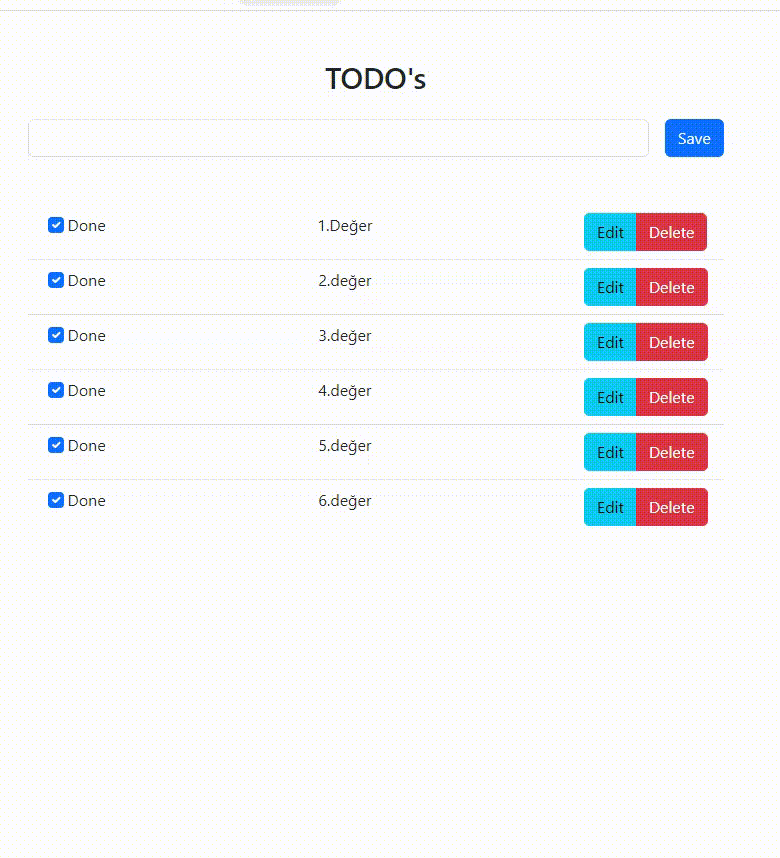

<!-- PROJECT LOGO -->
<br />
<div align="center" id="readme-top">
  <a href="https://github.com/sameteyuboglu/react-usestate-useref-axios-json-server">
    
  </a>

<h3 align="center">REACT TODO APP</h3>

  <p align="center">
    useState , useRef, axios, json server
  </p>
</div>

## Başlangıç

React ile birlikte useState , useRef, axios kullanımı için gerekli kurulumlar

### Kurulumlar

```sh
npm create vite@latest
```

```sh
npm install -g json-server
```

## Kullanımlar

Projemizi

```
npm create vite@latest react-todo-app --template react
```

```sh
cd react-todo-app
code .
```

ile oluşturuyoruz sonrasında projemizinde kullanacağımız axios'un kurulumunu yapıyoruz

```sh
npm install axios
```

proje root'unda olan db.json dosyamızı ayağa kaldırıyoruz

```
json-server --watch db.json --port 3030
```

sonra projemizi ayağa kaldırıyoruz

```sh
npm run server
```

<p align="right">(<a href="#readme-top">Başa Dön</a>)</p>


## Yapılacaklar

- [ x ] create Project
- [ x ] create Json Server
- [ x ] install Bootstrap
- [ x ] use Axios GET,PUT,DELETE,POST
- [ x ] useRef
- [ x ] useState
- [ x ] useEffect
- [ - ] Pager

<p align="right">(<a href="#readme-top">Başa Dön</a>)</p>


## Son Durum

